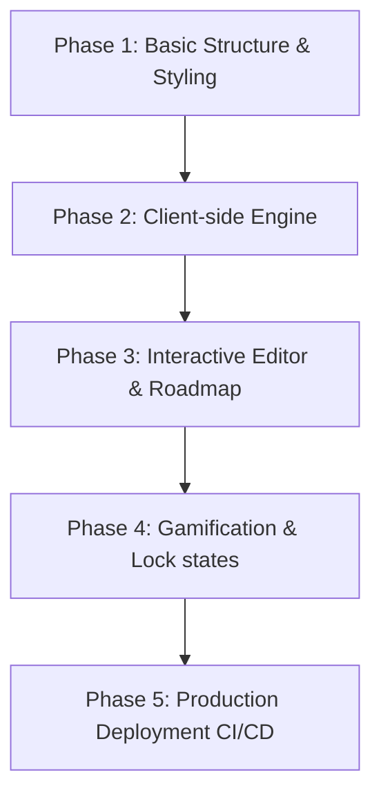

# Developing & Generating SQL Quest with Antigravity

This guide documents the development paradigm of building the SQL Quest application using **Antigravity**, Google DeepMind's agentic AI coding assistant. It covers the project's design philosophy, generation history, guidelines for prompting Antigravity, and testing workflows.

---

## 🚀 The Local-First Design Philosophy

SQL Quest was developed using a **local-first, zero-dependency** paradigm. This structural decision was driven by several core principles:

1. **Zero Latency**: By running a custom SQL simulator directly in-browser (`database.js`), query results and syntax warnings update instantly without network roundtrips.
2. **Clearer Compiler Errors**: Traditional SQL databases (like SQLite compiled to WebAssembly) throw generic, hard-to-read syntax errors. Our custom regex parser returns tailored, friendly advice (e.g., *"Typo Alert! You typed 'FORM' instead of 'FROM'. It happens to everyone!"*).
3. **No Hosting Overhead**: Running entirely client-side means the project can be hosted completely free on standard static providers (like GitHub Pages or Surge) without databases, server environments, or API key configurations.

---

## 📈 Generation Timeline

The project was generated iteratively through collaboration between the user and Antigravity:



* **Phase 1: Foundation**: Created the initial `index.html` structure and the *Tech-Editorial Light* stylesheet (`styles.css`).
* **Phase 2: Database Simulator**: Coded the core query parsing logic (`database.js`) to support projection, conditions, ordering, limits, and joins.
* **Phase 3: Live IDE & Explainer**: Implemented the editor console, syntax highlight overlays, node modal details, and keystroke-level SQL explanation.
* **Phase 4: Game Mechanics**: Locked the Sandbox and Live Examples until the cadet completes the first two levels.
* **Phase 5: GitHub Pages CI/CD**: Wired up a GitHub action `.github/workflows/gh-pages.yml` to automatically build and deploy the app on code commits.

---

## 💬 Prompts to Extend SQL Quest with Antigravity

When you want to add features, refine styles, or fix code, you can use these prompt templates directly with Antigravity in the chat window.

### 1. Adding a New Table
To expand the dataset with a new table, copy-paste this prompt:
> **Prompt**: Let's add a new table named `hull_sections` with columns `id` (INT), `section_name` (VARCHAR), `damage_level` (INT), and `shield_active` (BOOL). Add 5 mock rows of data to `DATASETS` in `database.js`. Update the table list in the Sandbox tab schema UI inside `index.html` and `app.js`.

### 2. Creating a New Quest Level
To append a new quest to the onboarding curriculum:
> **Prompt**: Let's add Quest 6 called "Repair the Hull". The objective should be: query the new `hull_sections` table for sections with a `damage_level > 50` and sorted by highest damage first. Update the `QUESTS` array in `app.js` with the validation predicate and success message. Add a corresponding Roadmap Node in the sidebar.

### 3. Expanding the SQL Engine
To support more SQL clauses:
> **Prompt**: Let's add support for `GROUP BY` and `HAVING` clauses in `database.js`. Update the query parser regex to extract these clauses, and implement a custom grouping bucket logic inside `runSQLQuery`. Write a testing script under `scratch/test_groupby.js` and run it to verify results.

---

## 🧪 Testing & Verification Workflows

Before deploying changes, Antigravity uses isolated tests to verify the integrity of the SQL engine:

### 1. Running Console Tests
Two testing harnesses are available to run offline in Node.js:
- **`scratch/test_parser.js`**: Tests basic SELECT, FROM, WHERE, ORDER BY, LIMIT, and aggregations.
- **`scratch/test_expanded.js`**: Validates the SQL `JOIN` engine and column aliasing.

Run them locally from PowerShell or CMD:
```powershell
node scratch/test_parser.js
node scratch/test_expanded.js
```

### 2. Local Manual Verification
To test changes in the browser before pushing:
1. Open `index.html` directly in a browser (or launch a local server: `npx http-server`).
2. Run queries in the editor pane to check outputs.
3. Complete Quest 1 and Quest 2 to verify Sandbox and Live Examples unlock correctly.

### 3. Deploying to Live Production
To publish the latest changes:
* **GitHub Pages**: Simply commit and push your changes to your GitHub remote main branch:
  ```powershell
  git add .
  git commit -m "docs: add comprehensive guides"
  git push origin main
  ```
  The GitHub action will build and deploy the site in ~1 minute.
* **Surge**: Double click the `deploy.bat` file in Windows Explorer to immediately host it.
