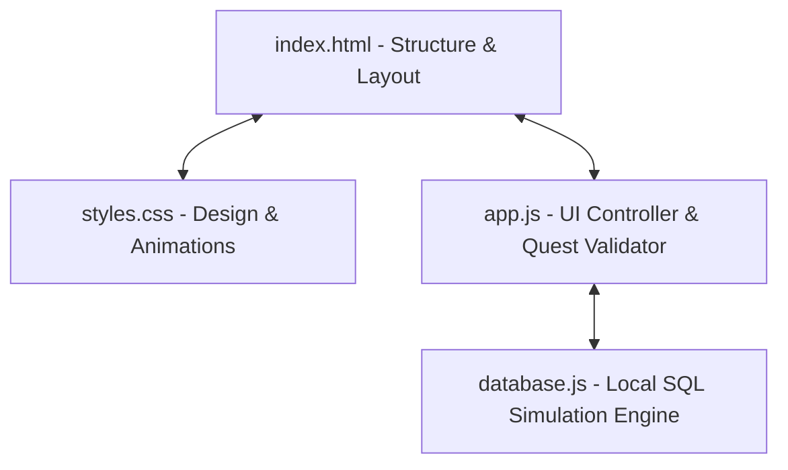

# SQL Quest: Architectural & Technical Guide

SQL Quest is a client-side, gamified, space-themed interactive SQL learning environment. It features a persistent 3-pane IDE layout, an in-browser custom SQL parsing engine, 5 gamified levels, an AI Query Copilot sidebar, and a Real-Time Query Explainer ("Live Tutor").

This document describes the architectural layout, codebase details, database schema, and operational mechanics of the application.

---

## 🗺️ Architectural Overview

SQL Quest is built as a single-page application (SPA) with zero external server dependencies, running entirely client-side. The codebase consists of three main files:



### Component Breakdown
1. **`index.html`**: Defines the 3-pane responsive layout (Navigation/Roadmap sidebar, SQL Code Editor, and the Live Results/Tutor pane). It also includes locked modal panels and tabs.
2. **`styles.css`**: Built on the *Tech-Editorial Light* aesthetic using specific custom properties. Implements code formatting, glassmorphism, responsive grids, and sleek CSS transitions.
3. **`database.js`**: Contains the client-side SQL parser, compiler, and runner. It hosts the static space-themed dataset and simulates operations (`SELECT`, `JOIN`, `WHERE`, `ORDER BY`, `LIMIT`, and aggregations like `COUNT`, `SUM`, `AVG`).
4. **`app.js`**: Coordinates the state machine (current level, highest completed level, locks), handles tab-switching, connects keyboard inputs, runs real-time query explanations on keystrokes, and links the editor to the mock database.

---

## 💾 Space Academy Database Schema

The application includes four space-themed tables designed to teach relational SQL basics. These tables are defined as static JSON objects inside [database.js](file:///C:/Users/shash/.gemini/antigravity/scratch/sql-basics-academy/database.js).

### 1. `space_crew`
Contains the roster of cadets, officers, and droids aboard the ship.
* **Primary Key**: `id` (integer)

| Column | Type | Description |
| :--- | :--- | :--- |
| `id` | INTEGER | Unique identifier for each crew member |
| `name` | VARCHAR | Full name of the crew member |
| `role` | VARCHAR | Professional designation (e.g., Captain, Navigator, Droid) |
| `status` | VARCHAR | Current crew status (`Active`, `Retired`, `Suspended`) |
| `years_active`| INTEGER | Number of years in service |

### 2. `planets`
Contains data regarding explored planets and cosmic entities.
* **Primary Key**: `id` (integer)

| Column | Type | Description |
| :--- | :--- | :--- |
| `id` | INTEGER | Unique identifier for the planet |
| `name` | VARCHAR | Name of the planet |
| `distance_ly` | FLOAT | Distance from the home station in light-years |
| `type` | VARCHAR | Planetary composition classification |
| `has_life` | BOOLEAN | Indicates if organic biosignatures were detected |

### 3. `cargo`
Tracks cargo items loaded in the ship's cargo bay.
* **Primary Key**: `id` (integer)

| Column | Type | Description |
| :--- | :--- | :--- |
| `id` | INTEGER | Unique identifier for the cargo unit |
| `item` | VARCHAR | Name of the supply or item |
| `category` | VARCHAR | Storage classification (`Tech`, `Supplies`, `Fuel`, `Specimens`) |
| `weight_kg` | INTEGER | Mass of the item in kilograms |
| `secured` | BOOLEAN | Indicates if locked down securely in cargo bay |

### 4. `space_missions`
Tracks mission flight details, mapping pilot IDs back to the crew roster.
* **Primary Key**: `id` (integer)
* **Foreign Key**: `pilot_id` (references `space_crew.id`)

| Column | Type | Description |
| :--- | :--- | :--- |
| `id` | INTEGER | Unique mission identifier |
| `pilot_id` | INTEGER | Roster ID of the crew pilot |
| `destination` | VARCHAR | Target planet |
| `ship` | VARCHAR | Spaceship hull name |

---

## ⚙️ In-Browser Database Engine (`database.js`)

The engine in [database.js](file:///C:/Users/shash/.gemini/antigravity/scratch/sql-basics-academy/database.js) is a custom regex-based SQL parser designed to match queries, check constraints, perform calculations, and report user-friendly compiler errors.

```
[SQL Query String] ──► [Whitespace Normalization & Cleanup]
                              │
                    [SQL Keyword Tokenizer]
                              │
                    ┌─────────┴─────────┐
                    ▼                   ▼
             [Standard SELECT]    [JOIN Query]
                    │                   │
                    ▼                   ▼
             [Apply WHERE]        [Execute JOIN]
                    │                   │
                    ▼                   ▼
             [Apply ORDER]        [Apply WHERE]
                    │                   │
                    ▼                   ▼
             [Apply LIMIT]        [Apply ORDER]
                    │                   │
                    ▼                   ▼
           [Compute Aggregations (COUNT, SUM, AVG)]
                              │
                              ▼
                        [Data Results]
```

### Supported Syntaxes
- **Standard Select**:
  ```sql
  SELECT [column_list | * | Aggregations] FROM [table_name] [WHERE filters] [ORDER BY col [ASC|DESC]] [LIMIT num];
  ```
- **Inner Join**:
  ```sql
  SELECT [columns] FROM [t1] JOIN [t2] ON [t1.col1 = t2.col2] [WHERE filters] [ORDER BY col] [LIMIT num];
  ```

### Aggregations
The engine parses expressions like `COUNT(*)`, `COUNT(col)`, `AVG(col)`, `SUM(col)`, `MIN(col)`, and `MAX(col)`. When aggregates are combined with regular columns, the engine computes them over the entire filtered row set and collapses the output to a single aggregated row, aligning with basic SQL conventions.

### Query Analyzer & Error Handlers
* **Keyword Checking**: Catches common beginner mistakes (like spelling `SELECT` as `SELEC` or typing `FORM` instead of `FROM`).
* **Table Verification**: Checks if a queried table exists and displays a helpful error containing all valid table options.
* **Column Validation**: Verifies that requested columns exist in the target table's schema, providing a list of available columns on failure.

---

## 🛡️ Gamification & Locks

To make the onboarding experience structured and challenging, SQL Quest locks advanced features behind quest completion.

### Locking Logic
* **Sandbox Mode** (AI SQL Playground) is locked at start.
* **Live Examples** (Real-Time Click-to-Run Code Chips) are locked at start.
* **Unlock Condition**: Both are unlocked once the user completes **Quest 1** ("Gather the Crew") AND **Quest 2** ("Find the Navigator").

> [!IMPORTANT]
> The locking mechanism is tracked reactively via the state variable `highestCompletedLevel` in `app.js`.

### How Locks are Implemented:
1. **Navigation Click Handling**: Clicking the "AI Playground" tab checks `highestCompletedLevel < 2`. If it is locked, it shows a warning modal prompting the user to complete the first two quests:
   ```javascript
   if (tabId === "sandbox" && highestCompletedLevel < 2) {
     showLockedSandboxModal();
     return;
   }
   ```
2. **Interactive Code Chip Rendering**: The live sidebar examples are updated on state changes. If locked, they display a lock icon and warning instead of actionable SQL shortcuts:
   ```javascript
   if (highestCompletedLevel < 2) {
     container.innerHTML = `<div class="locked-indicator">🔓 Complete Quest 1 and Quest 2 to unlock examples.</div>`;
   }
   ```

---

## 🤖 Real-Time Explainer & Assistant

One of the application's core features is the **Live Tutor Panel** (under the Editor). This widget analyzes queries in real-time as the user types (on keydown/keyup events).

### Live Explanation Generator
Instead of waiting for the user to press "Run", `app.js` runs a background parser that:
1. Parses partially written SQL queries using soft regex (allowing for incomplete query structures).
2. Explains the purpose of the query in plain English:
   - *"You are selecting data from the space_crew table."*
   - *"You are sorting the results by weight_kg."*
3. Generates educational tips based on query components:
   - For example, if it detects `JOIN` without `ON`, it reminds the user: *"Don't forget to specify which matching columns link the tables using ON table1.id = table2.pilot_id!"*
